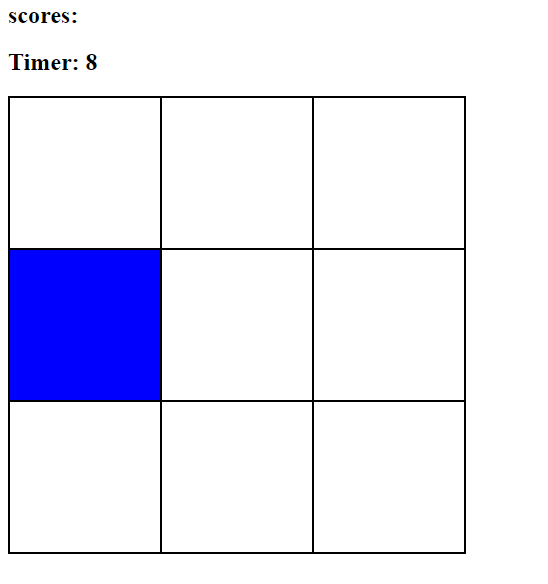
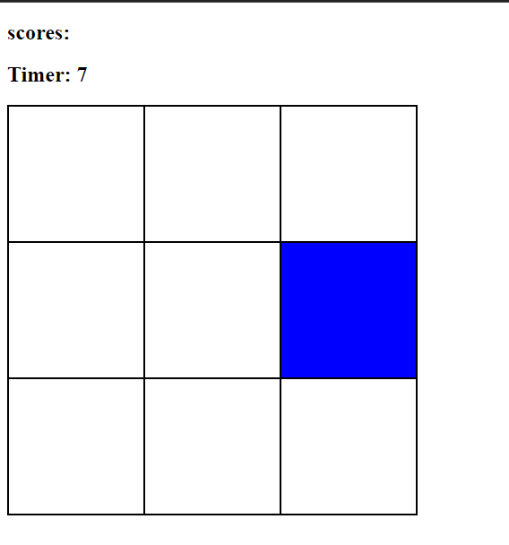
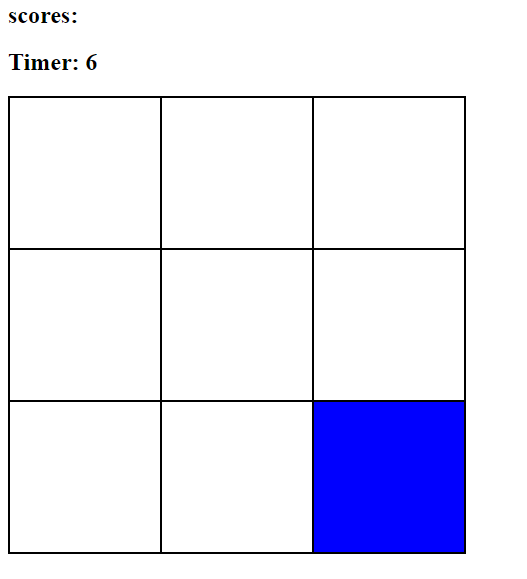

## Hit The Blue BOx
-This is a very basic game that uses HTML,CSS and JavaScript. you win a score if you hit the moving blue colored box, the score is displayed in front of score and the timer goes to zero in 30 secs, after 30 secs there will be a pop up showing that the Game is over and what is your score. I have used very basic javascript in this like timeInterval(), addEventListener() and the basic window APIs .
### Output

